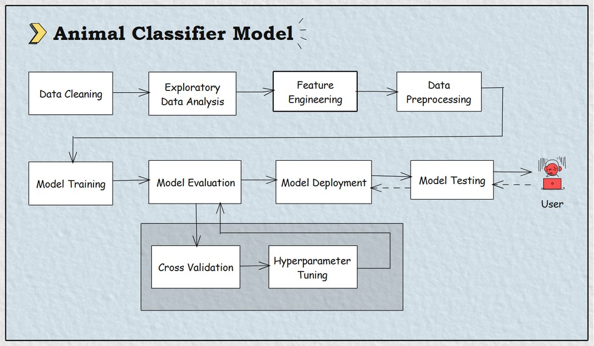

# Animal Classification Model

<div align="center">
  
  
  
  
  
</div>

<hr />


## Table of Contents

- [Overview](#overview)
- [Datasets](#datasets)
- [MLOps Pipeline](#mlops-pipeline)
- [Setup & Installation](#setup--installation)
    - [Clone repo](#step-1-clone-the-repository)
    - [Create Virtual Environment](#step-2-create-virtual-environment)
    - [Install Dependencies](#step-3-install-dependencies)
    - [Training the Model](#step-4-training-the-model)
    - [Testing/Prediction](#step-5-testingprediction)
- [Contribution](#contribution)
- [References](#references)


## Overview

This project is an **"Animal Classification System"** built using machine learning. It predicts the class of an animal (e.g., Mammal, Bird, Fish, etc.) based on its features. The model is trained on the UCI Zoo dataset and related class information


## Datasets

[UCI Zoo Dataset](https://archive.ics.uci.edu/dataset/111/zoo)

[Kaggle Zoo Animal Classification](https://www.kaggle.com/datasets/uciml/zoo-animal-classification/data)


The main dataset used is [zoo_animals_data.csv](./zoo_animals_data.csv), which contains features such as:


| Feature      | Description           |
|--------------|-----------------------|
| hair         | Has hair              |
| feathers     | Has feathers          |
| eggs         | Lays eggs             |
| milk         | Produces milk         |
| airborne     | Can fly/airborne      |
| aquatic      | Lives in water        |
| predator     | Is a predator         |
| toothed      | Has teeth             |
| backbone     | Has backbone          |
| breathes     | Breathes air          |
| venomous     | Is venomous           |
| fins         | Has fins              |
| legs         | Number of legs        |
| tail         | Has tail              |
| domestic     | Is domesticated       |
| catsize      | Cat-sized             |
| class_type   | Class type (numeric)  |
| class_name   | Class name (label)    |


## MLOps Pipeline




## Project Structure

```bash

classifier_model
|__ venv/                            # virtual env
|__ assets/*                         # miscellenous files for readme.md
|__ datasets/
  |__ preprocessed_data.csv          # save preprocessed data for testing
  |__ zoo_animal_data.csv            # original dataset
|__ models/
  |__ classifier_model.pkl           # saved model in .pkl
  |__ feature_names.pkl              # save feature_names for testing
|__ src/
  |__ model.py                       # model training file
  |__ test_model.py                  # to test model
|__ logs/*                           # logs for hyperparamter tuning values
|__ requirements.txt                 # install dependency pacakges
|__ README.md    
|__ LICENCE
|__ CONTRIBUTION.md                    

```


## Libraries and Tools

- **Machine Learning**: scikit-learn
- **Type of Machine Learning**: Supervised ML
- **Visual Charts**: matplotlib, seaborn
- **Save model**: joblib


## Model

- **Algorithm**: Logistic Regression 
- **Evaluation**: Accuracy, classification report, confusion matrix
- **Output**: Predicted animal class


## Setup & Installation

#### Step-1: Clone the repository

```bash
git clone https://github.com/mlops-hub/classifier-model.git
cd classifier-model
```

#### Step-2: Create Virtual Environment

```bash
python -m venv venv
venv\Scripts\activate
```

#### Step-3: Install Dependencies

```bash
pip install -r requirements.txt
```

#### Step-4: Training the Model

Run [`model.py`](./model.py) to train the classifier and save the model:

```bash
python model.py
```


#### Step-5: Testing/Prediction

Run [`test_model.py`](./test_model.py) to make predictions. If 'animal' is not found, you will be prompted to enter animal features, and the model will predict the class:

```bash
python test_model.py
```

The model achieves high accuracy in classifying animals into their respective classes.


## Contribution

Please read our [Contributing Guidelines](CONTRIBUTION.md) before submitting pull requests.


## License
This project is under [MIT Licence](LICENCE) support.
